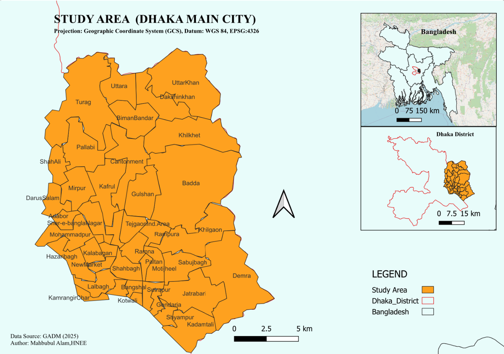
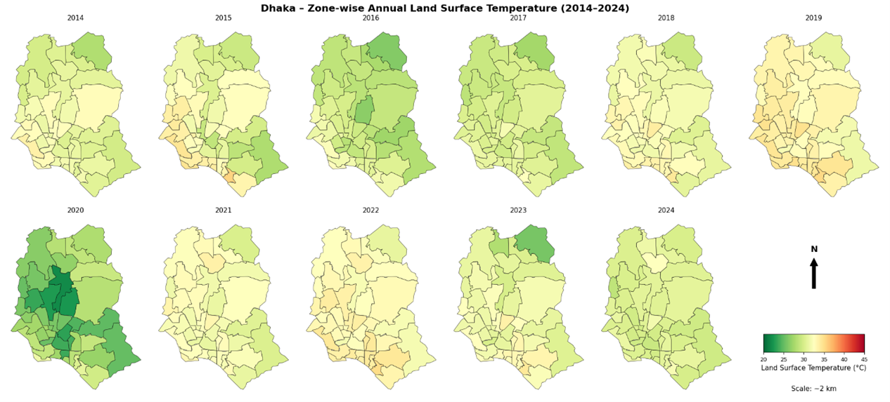
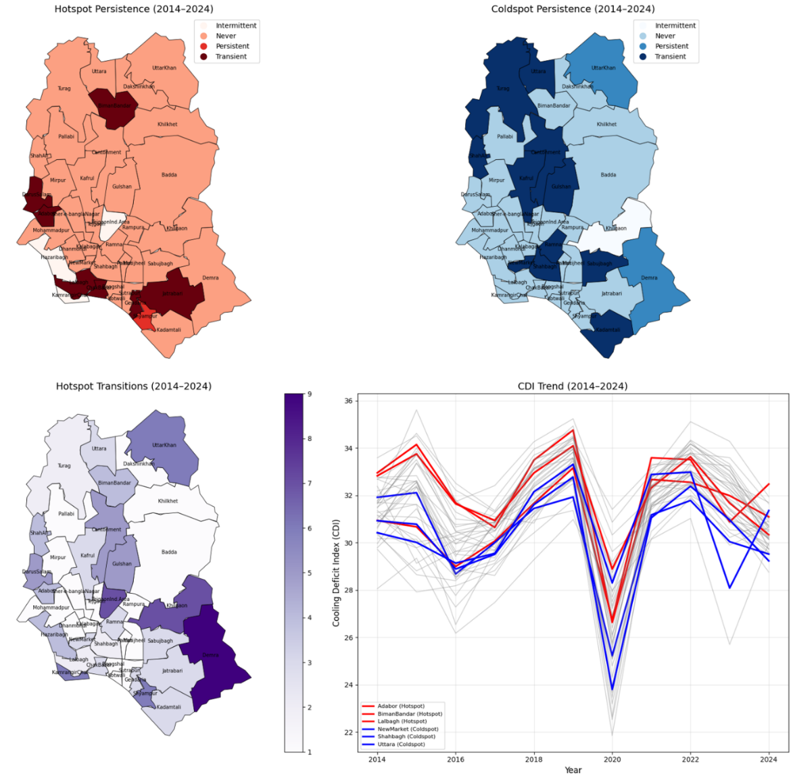
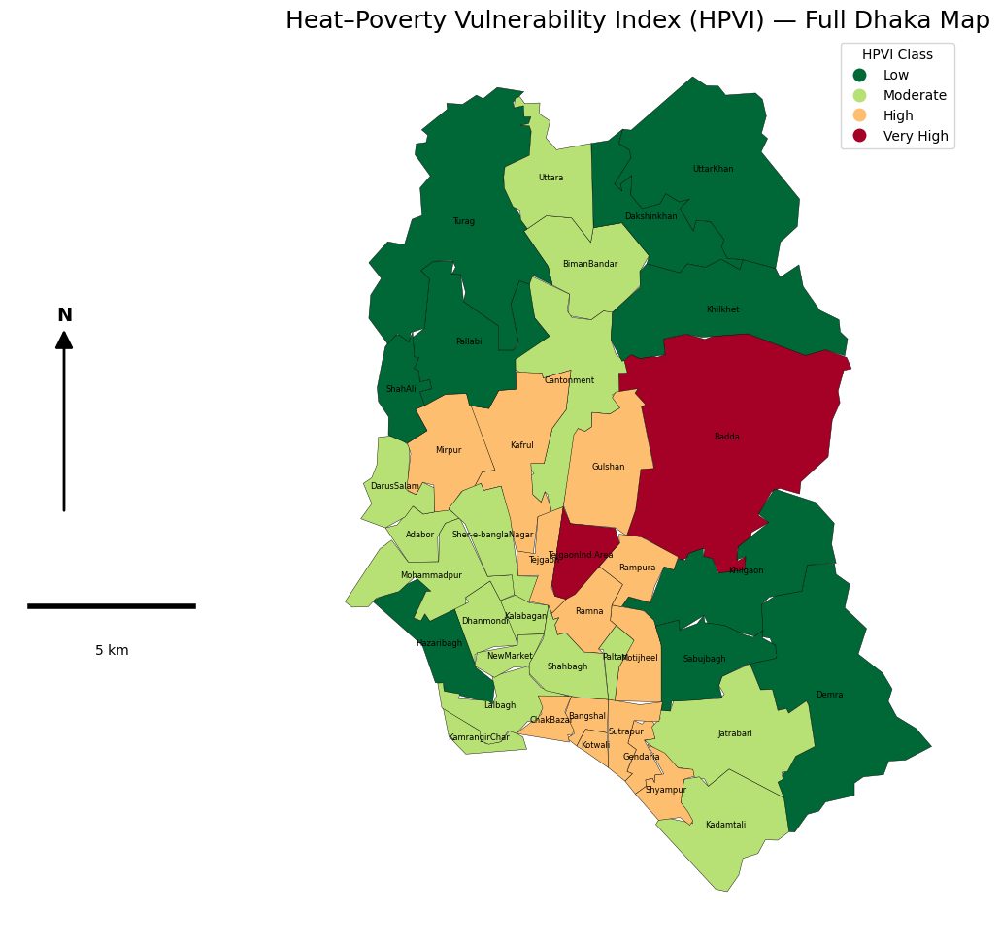
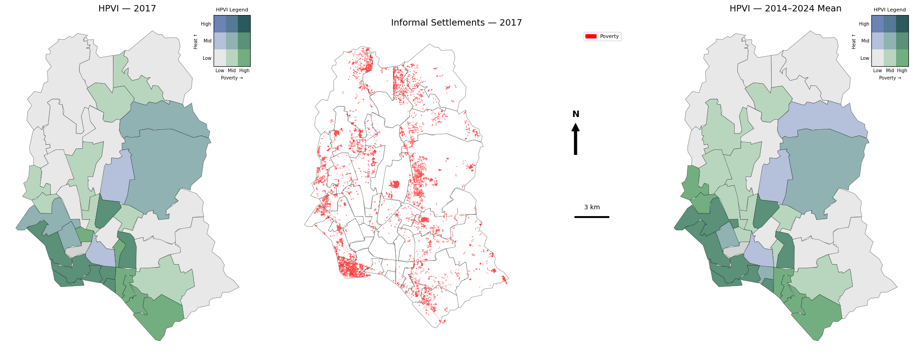
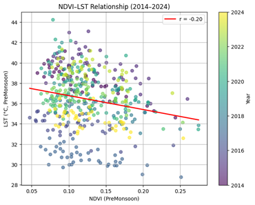
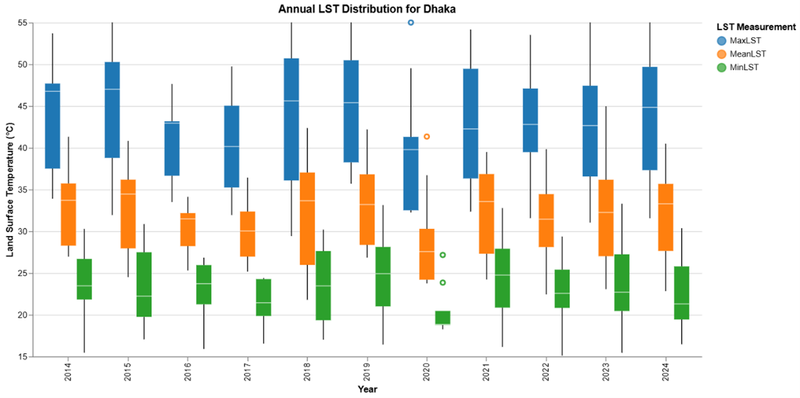
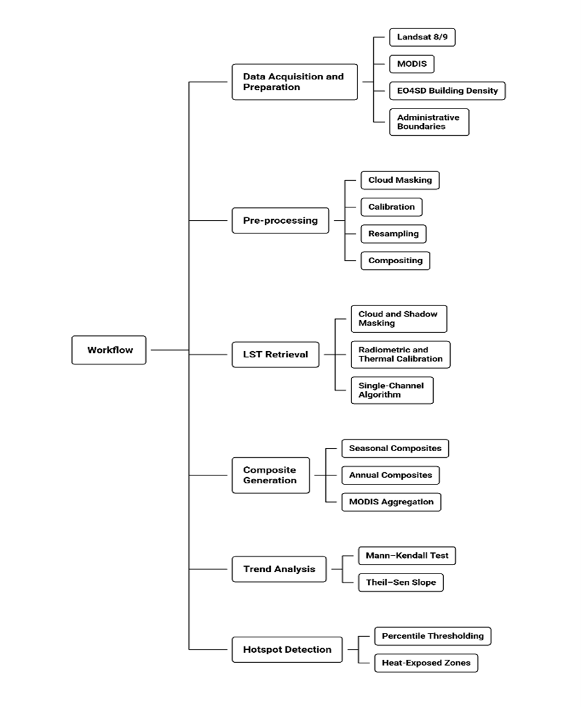

# Mapping the Heat Divide: Spatio‑Temporal Analysis of Thermal Hotspots and Socio‑Economic Inequality in Dhaka (2014–2024)

**Scientific Research Project – Final Code Repository**  
**Author:** Mahbubul Alam  
**Programme:** Master’s in Forest Information Technology (FIT)  
**Institution:** HNEE, Eberswalde  
**Supervisor:** Prof. Dr. Jan‑Peter Mund  

---

## 📝 Abstract

This repository contains the complete, reproducible analytical workflow developed for the scientific research project *“Mapping the Heat Divide: Spatio‑Temporal Analysis of Thermal Hotspots and Socio‑Economic Inequality in Dhaka (2014–2024)”*.  The study integrates multi‑year Landsat‑derived Land Surface Temperature (LST), hotspot persistence modelling, trend analysis, and socio‑economic indicators to assess long‑term thermal inequality in Dhaka.  All scripts, notebooks, and figures have been harmonised and validated for scientific reproducibility.

---

## 📁 Repository Structure
```
project/
│── data/                     
│── notebooks/
│     ├── 01_LST_Preprocessing.ipynb
│     ├── 02_Trend_Analysis.ipynb
│     ├── 03_Hotspot_Persistence.ipynb
│     ├── 04_SocioEconomic_Integration.ipynb
│     └── 05_HPVI_Construction.ipynb
│── src/
│     ├── lst_processing.py
│     ├── hotspot_detection.py
│     ├── zonal_statistics.py
│     └── hpvi_functions.py
│── outputs/
│     ├── figures/
│     ├── maps/
│     └── tables/
│── requirements.txt
│── README.md
```
---
### Study Area Map


## Methodological Workflow
The analysis follows a multi‑stage workflow consistent with the scientific report:

### 1. LST Retrieval and Pre‑Processing
- Cloud and shadow masking  
- Conversion to LST  
- Annual and seasonal composites  

### 2. Trend Analysis
- Mann‑Kendall significance test  
- Theil‑Sen slope estimation  
- MODIS‑based long‑term validation  

### 3. Hotspot Detection
- Hotspot and cold‑spot mapping  
- 10‑year hotspot persistence  

### 4. Socio‑Economic Integration
- Zonal statistics for building density  
- Poverty–heat correlation analysis  
- Ward‑level vulnerability assessment  

### 5. HPVI Construction
- Normalisation of indicators  
- Weighted index formulation  
- Classification into vulnerability levels  

### 6. Final Visualisation
- High‑resolution maps  
- Statistical plots  
- Multi‑panel comparison figures

## Important Figures

### 1. LST Trend (2014–2024) 

Displays long‑term warming patterns across Dhaka.

### 2. Hotspot Persistence (10-Year)


### 3. Heat–Poverty Vulnerability Index (HPVI)

Ward‑level vulnerability classification combining heat exposure and socio‑economic indicators.

### 4. Heat–Poverty Overlay

Visualises the spatial relationship between thermal hotspots and poverty.

### **5. NDVI–LST Relationship (Supplementary)**


Shows the cooling effect of vegetation.

### **6. LST Distribution **


### **7. Workflow Diagram**
 
Illustrates the full analytical pipeline from preprocessing to final mapping.


## Purpose of This Repository
This repository provides:

- Complete Jupyter notebooks for each analytical stage  
- Modular Python scripts for LST processing, hotspot detection, zonal statistics, and vulnerability mapping  
- All final figures used in the scientific report  
- A reproducible environment file  
- Full documentation of the analytical pipeline  

The structure ensures **transparency, clarity, and scientific reproducibility**.

---

## 🔁 Reproducibility Instructions

### **1. Install Dependencies**
```
pip install -r requirements.txt
```

### **2. Run Workflow in Order**
1. `01_LST_Preprocessing.ipynb`  
2. `02_Trend_Analysis.ipynb`  
3. `03_Hotspot_Persistence.ipynb`  
4. `04_SocioEconomic_Integration.ipynb`  
5. `05_HPVI_Construction.ipynb`  

### **3. Python Version**
- Python 3.10+

---

## 📦 Data Availability

### **Satellite Data**
- Landsat 8/9 (Google Earth Engine)  
- MODIS LST (GEE)

### **Socio‑Economic Data**
- EDSO 2017  
- NB_BUDENS  
- *Not included due to licensing restrictions.*  
- Users may obtain datasets directly from the original providers.

---

## 📚 Citation
If you use this workflow, please cite:

**Alam, M. (2026). Mapping the Heat Divide: Spatio‑Temporal Analysis of Thermal Hotspots and Socio‑Economic Inequality in Dhaka (2014–2024). Master’s project, HNEE.**

---

## 👤 Contact
**Mahbubul Alam**  
Master’s in Forest Information Technology (FIT)  
HNEE, Eberswalde  
Email: mahbubulalam2019ju@gmail.com  
GitHub: https://github.com/MahbubFIT Forest Information Technology (FIT)  
HNEE, Eberswalde
